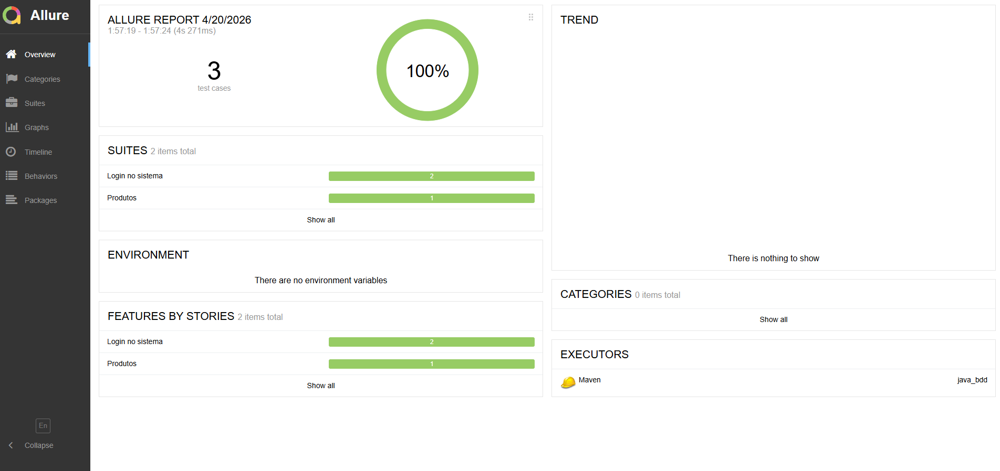
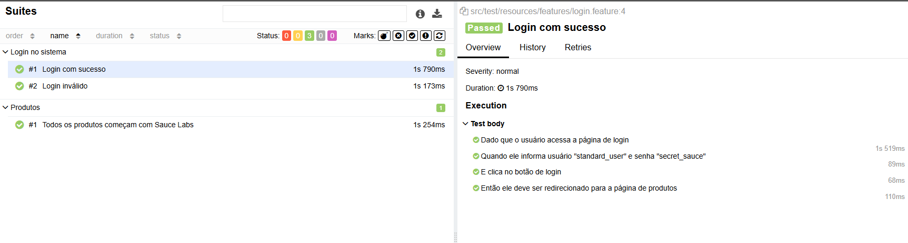
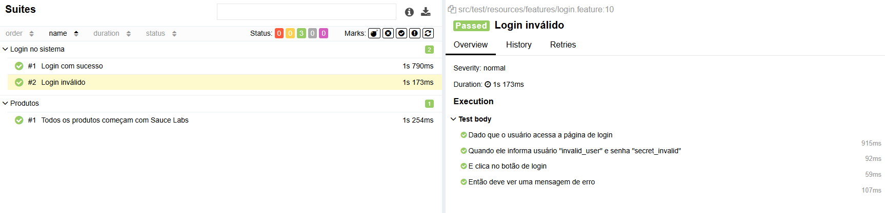
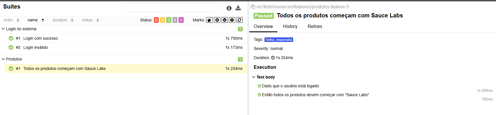

# Projeto de Testes Automatizados em Java

Este projeto contém testes automatizados de interface utilizando Selenium WebDriver, Cucumber (BDD), JUnit e Allure para geração de relatórios.

---

## Tecnologias utilizadas

- Java 21
- Selenium WebDriver
- Cucumber
- WebDriverManager
- Allure Framework
- Maven

---

## Estrutura do projeto

src  
├── test  
│    ├── java  
│    │     ├── runners  
│    │     │     └── TestRunner.java  
│    │     └── steps  
│    │           ├── LoginSteps.java  
│    │           └── ProdutoSteps.java  
│    └── resources  
│          └── features  
│                ├── login.feature  
│                └── produto.feature

---

## Execução dos testes

Para executar os testes:
mvn clean test

Geração e abertura do relatório Allure:
Gerar relatório:
mvn allure:serve

Abrir relatório no navegador:
allure serve target/allure-results

---

## Configuração do WebDriver

O projeto utiliza WebDriverManager para gerenciar automaticamente o driver do navegador.

---

## Estrutura dos Steps

LoginSteps:
- Acessar página de login
- Informar credenciais
- Validar autenticação

ProdutoSteps:
- Acessar página de produtos
- Listar produtos
- Validar informações

---

## Estrutura dos Runners

TestRunner:
Responsável por executar os testes Cucumber com as configurações de caminho das features, package dos steps e plugins de relatório.

---

## Exemplo de feature: Login

Funcionalidade: Login  
Cenário: Login válido 
Dado que acesso a página de login 
Quando informo usuário e senha válidos 
Então devo ser autenticado com sucesso 

## Exemplo de feature: Produto

Funcionalidade: Produto
Cenário: Validar listagem de produtos
Dado que acesso a área de produtos
Quando visualizo a lista de produtos
Então todos os produtos devem estar disponíveis

---

## Relatórios

Os resultados de execução são armazenados em: target/allure-results

---
## Resultados

## Observações

- Java 21 ou superior é necessário
- Maven deve estar configurado corretamente
- Allure CLI é necessário apenas para abertura local do relatório